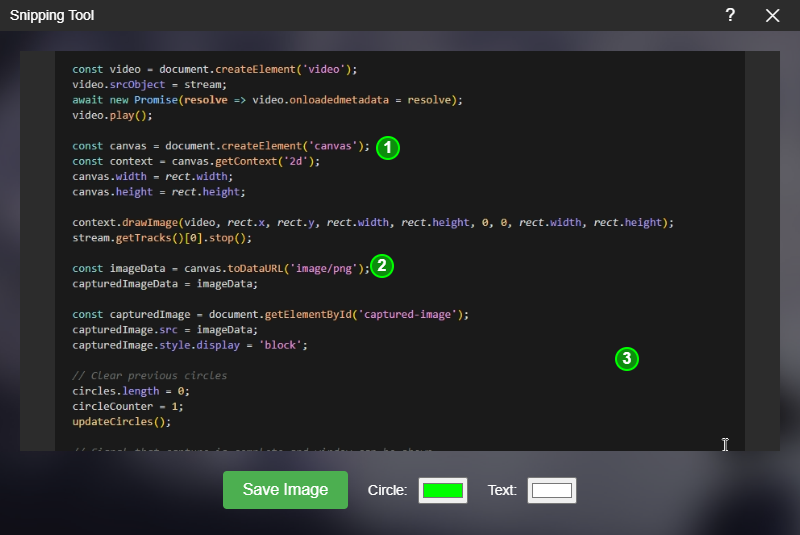

<h1 align="center"> Simple Snipping Tool </h1>

<p align="center">
</p>

A simple screenshot tool built with Electron that allows you to capture, annotate, and save screen captures with numbered circles. It's just a time saving tool for making some step-by-step image tutorial. Nothing more or less.

## Features

- 🖼️ Screen Area Selection: Capture any portion of your screen
- 🎯 Numbered Annotations: Add numbered circles to highlight important areas
- 🎨 Customization: Change circle and text colors
- 💾 Multiple Save Options:
  - Save to file (Ctrl+S or Save button)
  - Copy to clipboard (Ctrl+C)
- 🗑️ Easy Editing: Right-click to remove circles
- 🎨 Color Customization: Choose colors for circles and numbers
- 🖱️ Draggable Window: Move the window by dragging the title bar

## Installation

1. Clone the repository:
```bash
git clone https://github.com/ENEmyr/SimpleSnippingTool
cd SimpleSnippingTool
```

2. Install dependencies:
```bash
npm install
```

3. Start the application:
```bash
npm start
```

4. Build the application:
```bash
npm run build
```

## Usage

1. **Taking a Screenshot**
   - Press `Ctrl+Shift+C` to start snipping
   - Click and drag to select the area you want to capture
   - Press `Esc` to cancel the selection

2. **Adding Annotations**
   - Click anywhere on the captured image to add numbered circles
   - Circles are automatically numbered in sequence (1, 2, 3, etc.)
   - Right-click on any circle to remove it

3. **Customizing Appearance**
   - Use the color pickers to change:
     - Circle color
     - Text color

4. **Saving Your Work**
   - Click the "Save Image" button or press `Ctrl+S` to save to file
   - Press `Ctrl+C` to copy to clipboard

5. **Help**
   - Click the "?" button in the title bar to view keyboard shortcuts and instructions

## Keyboard Shortcuts

- `Ctrl+Shift+C`: Start snipping
- `Ctrl+S`: Save image to file
- `Ctrl+C`: Copy image to clipboard
- `Esc`: Cancel snipping

## Development

Built with:
- Electron
- HTML/CSS/JavaScript
- Node.js

## TODO

- ~~Support multiple monitors.~~

## License

MIT
